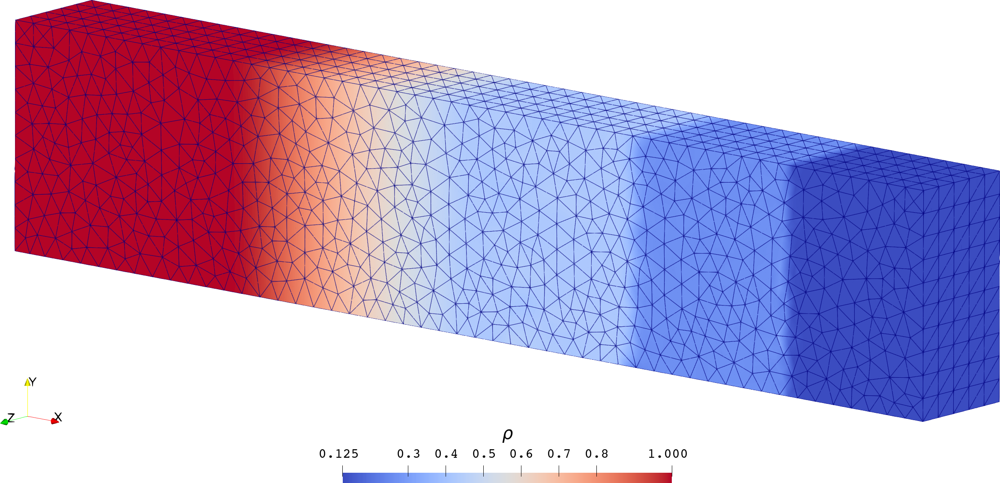
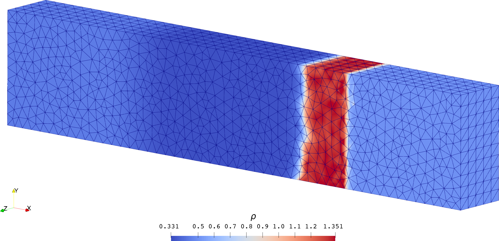
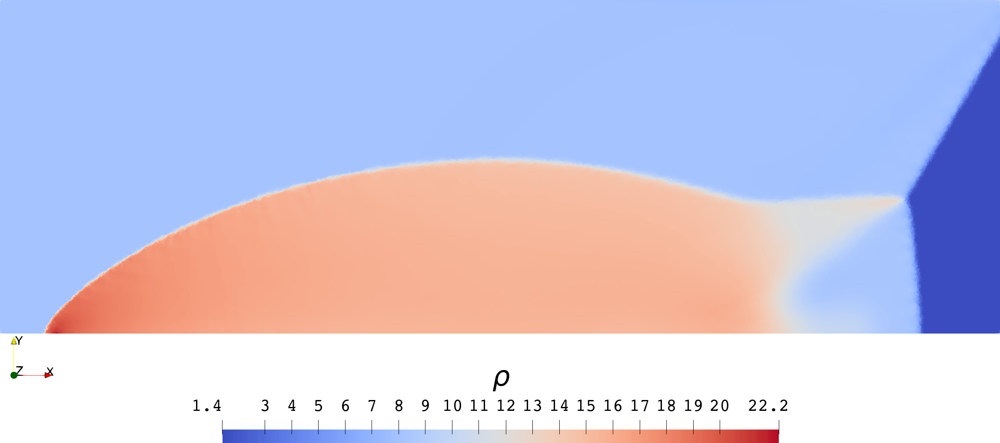
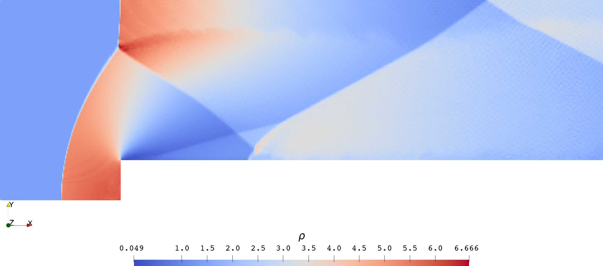
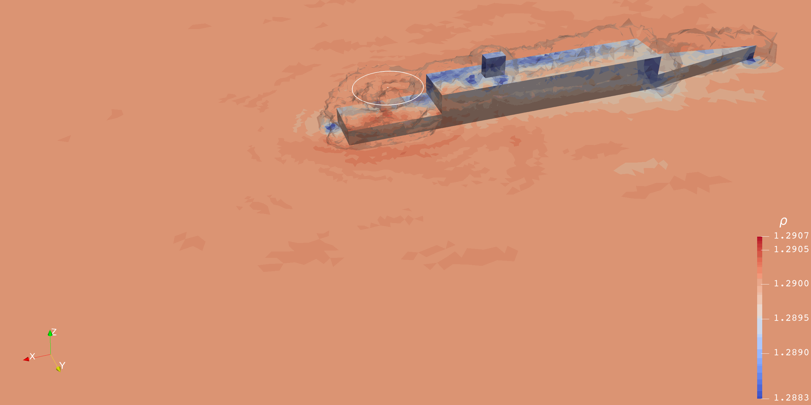

  <h1>舰载直升机气动干扰计算方法研究</h1>
  <h1>Study on Computational Method for Aerodynamic Interference of Shipborne Helicopters</h1>

----

| 中文关键词 | English Keywords |
|:--------:|:----------------:|
| 舰载直升机 | shipborne helicopter |
| 气动干扰 | aerodynamic interference |
| 旋翼空气动力学 | rotor aerodynamics |
| 间断伽辽金有限元法 | discontinuous Galerkin (DG) finite element method |
| 加权基本无振荡重构 | weighted essentially non-oscillatory (WENO) reconstruction |
| 非定常动量源模型 | unsteady momentum source (UMS) model |

# 一、绪论

## 1.1 研究背景和意义

- 美国海军陆战队 CH-46D 着舰事故案例
  - 
- 英国海军舰载直升机着舰标准作业流程（本文研究的[典型工况](#ship)）
  - 

## 1.2 国内外研究现状

## 1.3 研究内容

- 旋翼空气动力学模型：
  - 自由尾迹、涡粒子模型：常规实现 $$O(N^2)$$；难以处理复杂边界
  - 动态网格技术：变形网格、滑动网格、重叠网格，计算量大
  - 动量源模型：计算量小、易植入现有 CFD 求解器 ✅
- 船体、海面空气动力学模型：
  - 面元法：常规实现 $$O(N^2)$$；快速多级展开实现不易并行
  - CFD：
    - 有限差分法：不适应非结构网格
    - 有限体积法：适应非结构网格，但不易提高阶数
    - 有限单元法：适应非结构网格，易提高阶数，易并行 ✅

## 1.4 全文结构

# 二、舰载直升机三维流场的高阶计算格式

## 2.1 三维非结构网格上的 DG 空间离散

### 分段多项式近似

已知函数 $$u(x,y,z)$$ 在体单元 $$V_i$$ 上的多项式近似：

$$
u^{h}|_{V_{i}}(x,y,z)=\sum_{a,b,c}\hat{u}_{a,b,c}(x-x_{0})^{a}(y-y_{0})^{b}(z-z_{0})^{c},\quad(x,y,z)\in V_{i}.
$$

已知函数 $$u(x,y,z)$$ 在非结构网格 $$G$$ 上的多项式近似：

$$
u^{h}(x,y,z)=\begin{cases}
u^{h}|_{V_{1}}(x,y,z), & (x,y,z)\in V_{1},\\
\vdots & \vdots\\
u^{h}|_{V_{i}}(x,y,z), & (x,y,z)\in V_{i},\\
\vdots & \vdots\\
u^{h}|_{V_{N_{V(G)}}}(x,y,z), & (x,y,z)\in V_{N_{V(G)}}.
\end{cases}
$$

### 最优多项式近似

函数 $$u(\boldsymbol{r})$$ 在体单元 $$V_i$$ 的任意一组正交归一化的多项式基

$$
\underline{e}(\boldsymbol{r})=\begin{bmatrix}e_{1}(\boldsymbol{r}) & \cdots & e_{n}(\boldsymbol{r})\end{bmatrix}^{t}
$$

上的投影

$$
u^{h}(\boldsymbol{r})=\begin{bmatrix}\langle u\vert e_{1}\rangle_{V_{i}} & \cdots & \langle u\vert e_{n}\rangle_{V_{i}}\end{bmatrix}\begin{bmatrix}e_{1}(\boldsymbol{r})\\
\vdots\\
e_{n}(\boldsymbol{r})
\end{bmatrix}
$$

是 $$u(\boldsymbol{r})$$ 在由 $$\underline{e}(\boldsymbol{r})$$ 张成的线性空间中，关于 $$\mathcal{L}_2(V_i)$$ 的范数

$$
\Vert u-u^{h}\Vert=\left(\int_{V_{i}}|u-u^{h}|^{2}\right)^{1/2}
$$

最优的多项式近似。

### 正交归一化过程

由体单元 $$V_i$$ 上的任意一组（完备到 $$p$$ 次的）多项式基：

$$
\underline{\phi}(\boldsymbol{r}):=\begin{bmatrix}\phi_{1}(\boldsymbol{r}) & \phi_{2}(\boldsymbol{r}) & \cdots & \phi_{n}(\boldsymbol{r})\end{bmatrix}^{t},\qquad n=\binom{p+d}{d},
$$

总是可以构造出 $$V_i$$ 上的一组正交归一化的多项式基：

$$
\underbrace{\begin{bmatrix}e_{1}(\boldsymbol{r})\\
e_{2}(\boldsymbol{r})\\
\vdots\\
e_{n}(\boldsymbol{r})
\end{bmatrix}}_{\underline{e}}=\underbrace{\begin{bmatrix}S_{11}\\
S_{21} & S_{22}\\
\vdots & \vdots & \ddots\\
S_{n1} & S_{n2} & \cdots & S_{nn}
\end{bmatrix}}_{\underline{S}}\underbrace{\begin{bmatrix}\phi_{1}(\boldsymbol{r})\\
\phi_{2}(\boldsymbol{r})\\
\vdots\\
\phi_{n}(\boldsymbol{r})
\end{bmatrix}}_{\underline{\phi}}.
$$

### 加权残值弱形式

定义在区域 $$\Omega$$ 上的双曲型微分方程

$$
\partial_{t}\underline{U}+\nabla\cdot\underline{\boldsymbol{F}}=\underline{H}
$$

它等价于

$$
\int_{V}\left(\partial_{t}\underline{U}+\nabla\cdot\underline{\boldsymbol{F}}\right)\psi=\int_{V}\psi\,\underline{H}
$$
 
在 $$\forall V\subset\Omega$$ 上对任意充分光滑的函数 $$\psi\colon\Omega\to\mathbb{R}$$ 都成立。

经过一次分部积分并利用高斯散度定理可得**弱形式**：

$$
\int_{V}\left(\psi\,\partial_{t}\underline{U}-\underline{\boldsymbol{F}}\cdot\nabla\psi\right)+\oint_{\partial V}\psi\,\underbrace{\boldsymbol{\nu}\cdot\underline{\boldsymbol{F}}}_{\underline{F}^{\nu}}=\int_{V}\psi\,\underline{H}
$$

### DG 有限元方法

取一组以 $$V_i$$ 为支集、充分光滑的正交归一基函数 $$\left\{ \phi_{k}\right\} _{k=1}^{K}$$

则 $$U$$ 与 $$\psi$$ 可以分别近似为

$$
\underline{U}^{h}(\boldsymbol{r},t)=\sum_{k=1}^{K}\underline{\hat{U}}_{k}(t)\,\phi_{k}(\boldsymbol{r}),\qquad \psi^{h}(\boldsymbol{r})=\sum_{k=1}^{K}\hat{\psi}_{l}\,\phi_{k}(\boldsymbol{r})
$$

将其代入[弱形式](#weak-form)，并利用 $$\psi$$ 的任意性，即得常微分方程组

$$
\left(\frac{\mathrm{d}}{\mathrm{d}t}\underline{\hat{U}}\right)\begin{bmatrix}\langle\phi_{1}\vert\phi_{1}\rangle_{V_{i}} & \cdots & \langle\phi_{1}\vert\phi_{K}\rangle_{V_{i}}\\
\vdots & \ddots & \vdots\\
\langle\phi_{K}\vert\phi_{1}\rangle_{V_{i}} & \cdots & \langle\phi_{K}\vert\phi_{K}\rangle_{V_{i}}
\end{bmatrix}=\underline{R}_{V_{i}}-\underline{R}_{\partial V_{i}},\qquad\forall V_{i}\in V_{G(\Omega)}
$$

## 2.2 保持强稳定性的 RK 时间推进格式

一阶即显式欧拉推进：

$$
\underline{\hat{U}}^{n+1} =\underline{\hat{U}}^{n}+h_{t}\underline{\hat{R}}^{n}.
$$

常用的是三步三阶：

$$
\begin{aligned}\underline{\hat{U}}^{n+1/3} & =\underline{\hat{U}}^{n}+h_{t}\underline{\hat{R}}^{n},\\
\underline{\hat{U}}^{n+2/3} & =\frac{3}{4}\underline{\hat{U}}^{n}+\frac{1}{4}\left(\underline{\hat{U}}^{n+1/3}+h_{t}\underline{\hat{R}}^{n+1/3}\right),\\
\underline{\hat{U}}^{n+1}\equiv\underline{\hat{U}}^{n+3/3} & =\frac{1}{3}\underline{\hat{U}}^{n}+\frac{2}{3}\left(\underline{\hat{U}}^{n+2/3}+h_{t}\underline{\hat{R}}^{n+2/3}\right).
\end{aligned}
$$

## 2.3 模拟桨叶对流场扰动的非定常动量源

桨叶穿过四面体单元的几种常见情形：

含动量源的三维欧拉方程可以写成

$$
\partial_{t}\begin{bmatrix}\rho\\
\rho\boldsymbol{u}\\
\rho e_{0}
\end{bmatrix}+\nabla\cdot\begin{bmatrix}\rho\boldsymbol{u}\\
\rho\boldsymbol{u}\boldsymbol{u}\\
\rho h_{0}\boldsymbol{u}
\end{bmatrix}=\begin{bmatrix}0\\
{\color{red}\boldsymbol{b}_{\mathrm{V}}}-\nabla p\\
{\color{red}\boldsymbol{b}_{\mathrm{V}}\cdot\boldsymbol{u}}
\end{bmatrix},
$$

其中，$$\boldsymbol{b}_{\mathrm{V}}$$ 为单位体积气体所受到的外力。

体积分化为线积分：

$$
\int_{V_{i}}\phi_{k}(\boldsymbol{r})\,\boldsymbol{b}_{\mathrm{V}}(\boldsymbol{r})=\int_{\overline{RS}}\phi_{k}(\boldsymbol{r})\,\boldsymbol{b}_{\mathrm{L}}(\boldsymbol{r}).
$$

外力线密度：

$$
\boldsymbol{b}_{\mathrm{L}}(\boldsymbol{r}(s))=-\begin{bmatrix}\boldsymbol{e}_{L}(s) & \boldsymbol{e}_{D}(s)\end{bmatrix}
\begin{bmatrix}C_{L}(\alpha,M)\\
C_{D}(\alpha,M)
\end{bmatrix}
\rho c\frac{u^{2}+w^{2}}{2}
$$

## 2.4 间断、数值振荡与 WENO 重构技术

### 物理间断与数值振荡

可压缩流场的三种典型间断：

|  激波  | 接触间断 |  膨胀波  |
| :---: | :-----: | :-----: |
|  |  |  |

即使没有激波，桨叶上下表面之间的压强差也属于强间断！

例：阶跃函数的 DG3 近似在间断附近发生数值振荡：

### WENO 重构（限制器）

以本单元及面相邻单元的多项式为候选多项式：

$$
u_{k\to i}(\boldsymbol{r}):= u_{k}(\boldsymbol{r})-\langle u_{k}\rangle_{i}+\langle u_{i}\rangle_{i}
$$

计算各候选多项式的光滑度：

$$
\beta_{k\to i}=\sum_{\vert\alpha\vert=1}^{p}\frac{\vert V_{i}\vert^{2\vert\alpha\vert/\color{red}{3}}-1}{(\vert\alpha\vert!)^{2}}\int_{V_{i}}\left(\frac{\partial^{\vert\alpha\vert}u_{k\to i}}{\partial x^{\alpha_{x}}\partial y^{\alpha_{y}}\partial z^{\alpha_{z}}}\right)^{2}
$$

计算各候选多项式的非线性权重：

$$
w_{k\to i}=\frac{w_{k\to i}^{\beta}}{\sum_{k\in K_{i}}w_{k\to i}^{\beta}}
,\qquad w_{k\to i}^{\beta}=\frac{w_{k\to i}^{\star}}{\left(10^{-6}+\beta_{k\to i}\right)^{2}}
$$

以候选多项式的凸组合为重构的多项式：

$$
u_{i}^{\mathrm{new}}(\boldsymbol{r})=\sum_{k\in K_{i}}w_{k\to i}\,u_{k\to i}(\boldsymbol{r})
$$

# 三、高阶格式在非结构网格上的精度验证

## 3.1 基于线性平流问题解析解的定量验证

|  方案  | 结果  |
| :---: | :---: |
| 不加限制器 |  |
| 加密 $$h\downarrow$$ |  |
| 升阶 $$p\uparrow$$ |  |

|       |  一阶  | 三阶 |
| :---: | :---: | :---: |
|  云图  |  |  |
| 单元尺寸 | $$2^{-5}$$ | $$2^{-2}$$ |
| 计算时间 | $$306.3$$ | $$4.147$$ |
| $$L_1$$ 误差 | $$1.108$$ | $$1.021$$ |

## 3.2 基于一维流场数值精确解的定量验证

|       |  Sod  |  Lax  |
| :---: | :---: | :---: |
|  云图  |  |  |
|  线图  |  |  |

## 3.3 基于二维流场高精度近似解的定性验证

### 双马赫反射问题

|  方案  | 结果  |
| :---: | :---: |
| 时空一阶 |  |
| 时空二阶 |  |
| 时空三阶 |  |
| [Zhong (2013)](https://doi.org/10.1016/j.jcp.2012.08.028) |  |

### 前向台阶问题

|  方案  | 结果  |
| :---: | :---: |
| 时空三阶 |  |
| [Giri (2019)](https://doi.org/10.1002/fld.4757) |  |

## 3.4 本章小结

# 四、旋翼流场计算的并行加速及性能测评

## 4.1 旋翼流场计算

计算网格：

|  方案  |  爬升  |  前飞  |
| :---: | :---: | :---: |
| 时空一阶 |  |  |
| 时空三阶 |  |  |

## 4.2 并行加速方案

## 4.3 并行性能测评

用 [METIS](https://github.com/pvc1989/METIS) 对非结构网格分块：

| 双马赫反射 | 孤立旋翼爬升 |
| :------: | :--------: |
|  |  |

各进程单元数量的波动小于 $$3\%$$，大致满足负载均衡：

| 双马赫反射 | 孤立旋翼爬升 |
| :------: | :--------: |
|  |  |

加速比 $$S=\dfrac{T_1}{T_P}$$ 实测值：

| 双马赫反射 | 孤立旋翼爬升 |
| :------: | :--------: |
|  |  |

并行效率 $$E=\dfrac{S}{P}=\dfrac{T_1}{PT_P}$$ 实测值：

| 双马赫反射 | 孤立旋翼爬升 |
| :------: | :--------: |
|  |  |

## 4.4 本章小结

# 五、舰载直升机典型工况气动干扰的模拟

本章利用上述经过验证的 UMS–RK3/DG3 并行求解器，对一种舰载直升机典型工况下的**旋翼–船体–海面**气动干扰过程的进行模拟。

## 5.1 问题描述（典型工况、几何参数、网格）

该典型工况改编自 [Kääriä (2012)](https://doi.org/10.2514/1.C031535)，几何参数引自 [Thedin (2020)](https://doi.org/10.2514/1.c035643)。

| 几何参数 |  |
| 计算网格 |  |

除[悬停于甲板尾部上方](#悬停于甲板尾部上方)一小节外，旋翼中心均固定于点 $$(-45\,\mathrm{ft}, 22.5\,\mathrm{ft}, 40\,\mathrm{ft})$$ 处。

## 5.2 直升机正面迎风

### 悬停于甲板中部上方

起动涡在旋翼后缘形成，并随来流向后（右）运动，运动轨迹大致对应旋翼尾迹后缘。
- 尾迹**后缘**不受船体阻挡，“地面效应”来自海面。
- 尾迹**前缘**明显受到船尾甲板阻挡，“地面效应”来自甲板。
- 前者小于后者，故旋翼感受到向**后**翻滚的俯仰力矩。

### 悬停于甲板尾部上方

- 尾迹**前缘**和**后缘**都不受甲板阻挡。
- 旋翼所感受到的“地面效应”几乎完全来自于平直的海面。
- 该工况下的舰面起降难度与平地起降相当，且小于前一节的工况。

## 5.3 直升机侧面迎风（微风、劲风）

### 来流为微风

- 旋翼尾迹受海面自由来流的影响向**右后方**发展，并且因受到甲板的阻挡而发生变形。
- 旋翼**左前方**感受到来自甲板的“地面效应”，因而有向**右后方**翻滚的趋势。

### 来流为劲风

旋翼尾迹具有明显的非对称性：
- 旋翼**左侧**的涡结构几乎不受甲板影响，基本保持如孤立旋翼前飞时的形态；
- 旋翼**右侧**的涡结构与船体气流尾迹的涡结构相互缠绕，二者之间没有明显的分界面。

造成这种差异的主要原因在于船体两侧的气流不对称：
- 船体**迎风侧**的气流相对“干净”；
- 船体**背风侧**的气流则相对紊乱。

## 5.4 本章小结

# 结论与展望

## 结论

本文提出的 UMS–RKDG 求解器是模拟旋翼流场、研究舰载直升机气动干扰的一种高效、高精度的计算方法。
- 适用于三维非结构网格的 RKDG 求解器，能够处理具有复杂几何外形的边界，适用于航空航天领域的工程问题。
- 基于邻接单元的 WENO 重构过程，能够有效地压制间断附近的数值振荡，同时保持 RKDG 方法的紧致性、可并行性。
- 高阶 RKDG 求解器的数值耗散较低，能够在相对较粗的非结构网格上捕获复杂的流动细节，具有更高的性价比。
- 非定常动量源 (UMS) 模型与高阶 RKDG 求解器配合使用，能够在静态网格上高效、高精度地模拟旋翼对流场的扰动，避免了传统旋翼 CFD 方法对动态网格、滑动网格、重叠网格等高级网格技术的依赖。
- 动量源附近存在物理间断，可能在高阶近似解中引起数值振荡，必须像处理高速气流中的间断那样加以抑制。

## 创新点

提出、实现并验证了一种
- 适应非结构网格、支持分布式并行计算的高阶有限元 (RKDG) 方法。
- 适合旋翼流场计算的动量源--高阶有限元 (UMS--RKDG) 混合方法。
- 将 WENO 重构用于抑制高阶多项式解在桨叶附近产生数值振荡的方法。

## 后续研究方向

- 增加对高阶导数项的支持。
- 提供对隐式时间推进格式的支持。
- 提高前/后处理模块的并行化程度。
- 在公共高性能计算平台上测试并行性能。
- 尝试仅传递面单元（而非体单元）上的信息。
